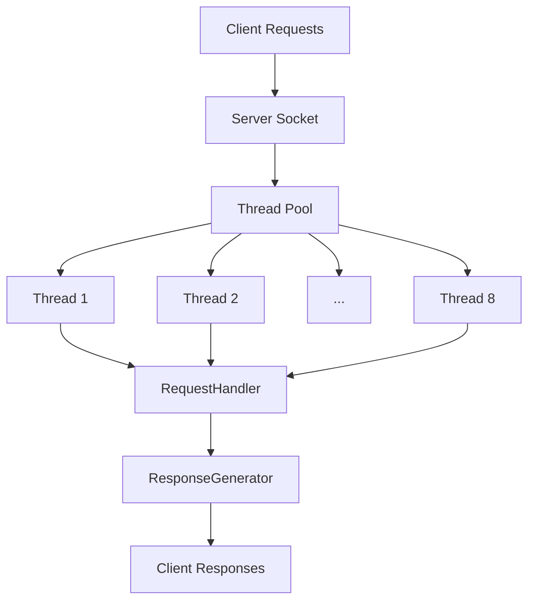

# Java HTTP Server
A simple, multi-threaded HTTP server implementation in Java that demonstrates basic web server concepts including request handling, routing, and concurrent client connections.
## Features

- **Multi-threaded**: Uses a thread pool with 8 threads to handle concurrent client connections
- **Basic Routing**: Supports multiple endpoints with different content
- **HTTP/1.1 Compatible**: Implements basic HTTP protocol standards
- **Lightweight**: No external dependencies, uses only Java standard library

Architecture


## Available Routes
- **/** : Home page with navigation links
- **/about** : Information about the server
- **/random** : Generates a random number (1-100)
- **/stats** : Displays server statistics
- **Other routes** :Returns 404 Not Found
How to Run
Compile the Java files:
```bash
javac HttpServer.java RequestHandler.java ResponseGenerator.java
```
Run the server:
```bash
java HttpServer
```
Access the server:
Open your browser and navigate to http://localhost:8080

